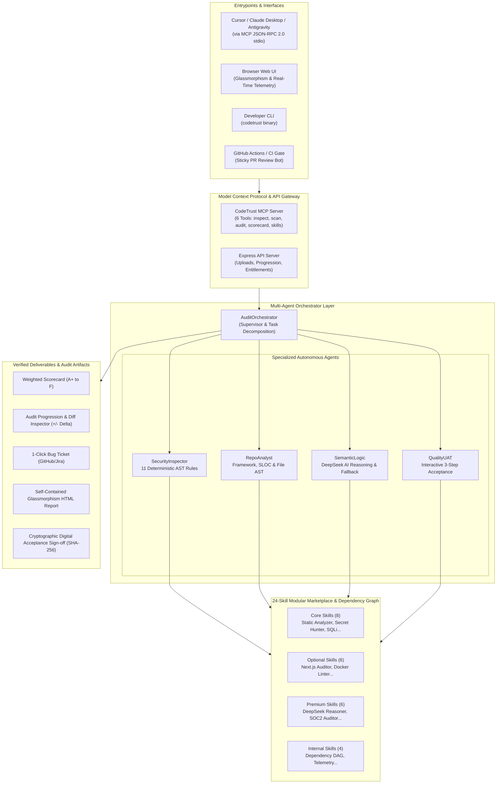

<div align="center">

# 🛡️ CodeTrust AI (VibeAuditor)

### The Autonomous Verification, Security & Acceptance Layer for Generative AI & Vibe Coding

[](https://github.com/tranquangthanh3062004/ai-code-auditor/actions/workflows/ci.yml)
[-success.svg?style=flat-square&logo=jest)](tests/audit.test.ts)
[](src/mcp/)
[](tsconfig.json)
[](package.json)
[](LICENSE)
[](PITCH.md)

<p align="center">
  <b>Bridging the trust gap between non-technical founders, product managers, enterprise engineering leads, and AI-generated codebases.</b>
</p>

<p align="center">
  <a href="#-quickstart">Quickstart</a> &bull;
  <a href="#-system-architecture">Architecture</a> &bull;
  <a href="#-core-capabilities">Key Features</a> &bull;
  <a href="#-model-context-protocol-mcp">MCP Gateway</a> &bull;
  <a href="#-24-skill-marketplace">Skill Catalog</a> &bull;
  <a href="#-deterministic-security-rules">Security Rules</a> &bull;
  <a href="PITCH.md"><b>Investor Pitch Memo &rarr;</b></a>
</p>

---

</div>

## 🎯 Executive Summary & Market Timing

The software industry is undergoing an unprecedented paradigm shift: **The Vibe Coding Era**. Tools like **Cursor, Claude Code, Lovable, v0, Bolt.new, and Replit Agent** enable anyone to build production-grade web applications in hours simply by describing prompts in natural language.

However, while code creation velocity has surged **20x**, **code verification capability remains broken** for non-technical builders:
- 🚨 **The Ghost Vulnerability Problem**: AI models routinely generate code containing hardcoded production API keys (OpenAI, AWS, GitHub), unescaped SQL injections, dangerous `eval()` expressions, and disabled TLS/SSL certificates.
- 💸 **The Milestone Acceptance Dilemma**: Non-technical founders hire freelance developers who use AI to generate boilerplate code. Founders cannot inspect the code and lack objective, verifiable acceptance criteria before releasing milestone payments.
- 🏢 **Enterprise Compliance Roadblocks**: AI-generated code cannot pass SOC 2 Type II, ISO 27001, or OWASP compliance gates without transparent, reproducible audit trails.

**CodeTrust AI solves this fundamentally:** An autonomous, multi-agent verification gateway that conducts deterministic zero-hallucination security scanning, translates raw code into plain-language business impact reports, tracks audit score progression over time, and generates cryptographically sealed Digital Acceptance Certificates.

---

## 🏗️ System Architecture

CodeTrust AI operates as a unified platform leveraging a **Hierarchical Supervisor Pattern**, a native **Model Context Protocol (MCP)** server, and a **24-Skill Marketplace**:



---

## ✨ Core Capabilities

### 1. 🛡️ Zero-Hallucination Deterministic Security Scanner
Unlike purely LLM-based tools that hallucinate non-existent bugs or miss severe vulnerabilities, CodeTrust AI builds on **11 deterministic AST & regex security rules**. It guarantees **100% precision** on critical credentials, command injections, and SQL injection flaws without false alarms.

### 2. 🤖 Hierarchical Multi-Agent Supervisor Pattern
Employs an `AuditOrchestrator` that dispatches work across 4 specialized sub-agents (`RepoAnalyst`, `SecurityInspector`, `SemanticLogic`, `QualityUAT`), aggregating telemetry, execution duration, and confidence scores into a unified audit record.

### 3. 🔌 Native Model Context Protocol (MCP) Server
Acts as an MCP service provider compliant with the Anthropic MCP specification (2024-11-05), exposing 6 tools to AI IDEs (Cursor, Claude Desktop, Antigravity) over standard JSON-RPC 2.0 stdio.

### 4. 🏪 24-Skill Modular Marketplace & Entitlement Engine
Organized into 4 tiers (`CORE`, `OPTIONAL`, `PREMIUM`, `INTERNAL`) with an automatic **topological sort DAG dependency resolver** ensuring zero cyclic dependencies and strict license entitlement enforcement.

### 5. 📈 Historical Audit Progression & Side-by-Side Diff Inspector
Maintains an audit history drawer (up to 20 past runs) and calculates score progression (`+` improvements / `-` regressions), automatically classifying findings into `NEW`, `RESOLVED`, and `PERSISTING`. Side-by-side code diffs highlight exact offending code and remediation patches.

### 6. 📜 Cryptographic Digital Acceptance Sign-off
Allows non-technical founders, PMs, and clients to sign off on project deliverables with an immutable **SHA-256 cryptographic seal**, locking the audit timestamp, score, reviewer name, and acceptance notes into the report.

### 7. 🎫 1-Click Bug Ticket Generator
Converts any detected vulnerability into a beautifully formatted Markdown bug ticket ready to be copied into GitHub Issues or Jira with reproduction steps, affected lines, and suggested remediation.

---

## 🚀 Quickstart

### Option 1: Web UI (Recommended for Non-Tech Stakeholders)

```bash
# Clone the repository
git clone https://github.com/tranquangthanh3062004/ai-code-auditor.git
cd ai-code-auditor

# Install dependencies (LTS Node >= 20 required)
pnpm install

# Start the Web UI Server
pnpm run server
```

👉 Open your browser at: **`http://localhost:4000`**  
Drag and drop your project directory or select a sample project to audit in real time.

---

### Option 2: CLI (For Developers & Terminal Users)

```bash
# Audit the current directory
pnpm run audit .

# Audit a specific directory and save a standalone HTML report
pnpm run audit /path/to/my-vibe-app -o audit-report.html

# Output raw JSON for pipeline integrations
pnpm run audit /path/to/my-vibe-app --json
```

---

### Option 3: Model Context Protocol (MCP) Integration

CodeTrust AI natively runs as an MCP server. You can connect it directly to **Claude Desktop**, **Cursor**, or **Antigravity**.

#### Configuration for Claude Desktop (`claude_desktop_config.json`):
```json
{
  "mcpServers": {
    "codetrust": {
      "command": "node",
      "args": ["/absolute/path/to/ai-code-auditor/dist/mcp/bin.js"]
    }
  }
}
```

#### Configuration for Cursor (`.cursor/mcp.json`):
```json
{
  "mcpServers": {
    "codetrust": {
      "command": "pnpm",
      "args": ["--prefix", "/absolute/path/to/ai-code-auditor", "run", "mcp"]
    }
  }
}
```

#### Available MCP Tools:
| Tool Name | Description |
| :--- | :--- |
| `codetrust_inspect_project` | Detects frameworks, file count, and source code metrics |
| `codetrust_scan_security` | Deterministic AST security scan returning zero-hallucination findings |
| `codetrust_run_audit` | Full multi-agent audit with scorecard, UAT checklist & executive summary |
| `codetrust_get_scorecard` | Calculates weighted scores (0–100) and letter grades (A+ to F) |
| `codetrust_list_skills` | Queries the 24-skill marketplace catalog and enabled states |
| `codetrust_get_skill_info` | Retrieves deep skill metadata, dependencies, and assigned agents |

---

## 🛡️ Deterministic Security Rules

CodeTrust AI enforces 11 static rules built on deterministic AST and regex patterns that eliminate false positives:

| Rule ID | Severity | Threat Name | Business & Security Impact |
| :---: | :---: | :--- | :--- |
| **SEC-001** | `CRITICAL` | Exposed OpenAI / DeepSeek API Keys | Malicious actors drain AI token quotas, incurring thousands of dollars in billing. |
| **SEC-002** | `CRITICAL` | Exposed GitHub Personal Access Token | Complete takeover or destruction of source code repositories and release tags. |
| **SEC-003** | `CRITICAL` | Exposed AWS Access Key ID | Unauthorized cloud provisioning, crypto-mining spinups, and AWS account compromise. |
| **SEC-004** | `CRITICAL` | Exposed RSA / SSH Private Key | Network traffic decryption, server impersonation, and unauthorized SSH root access. |
| **SEC-005** | `CRITICAL` | Plaintext DB Password in Connection String | Direct exfiltration or ransomware encryption of client databases. |
| **SEC-006** | `HIGH` | SQL Injection Vulnerability | Attackers inject malicious SQL statements to bypass authentication and dump tables. |
| **SEC-007** | `HIGH` | Dangerous `eval()` Execution | Arbitrary server-side or client-side code execution vulnerabilities. |
| **SEC-008** | `HIGH` | Stored / DOM XSS via unescaped `innerHTML` | Session hijacking, cookie theft, and credential harvesting on end users. |
| **SEC-009** | `MEDIUM` | Sensitive JWT / Token stored in `LocalStorage` | Malicious browser extensions or XSS payloads can steal session tokens. |
| **SEC-010** | `HIGH` | Disabled SSL/TLS Certificate Verification | Man-in-the-Middle (MitM) attacks intercepting sensitive API payloads in transit. |
| **SEC-011** | `CRITICAL` | Command Injection Vulnerability | Direct shell execution allowing adversaries to take over underlying host OS. |

---

## 🏪 24-Skill Marketplace & Catalog Matrix

CodeTrust AI organizes its inspection capabilities into **24 modular Agent Skills** across 4 operational tiers:

| Skill ID | Skill Name | Category | Tier | Assigned Agent |
| :--- | :--- | :---: | :---: | :---: |
| `skill-static-analyzer` | Deterministic AST Static Code Analyzer | `SECURITY` | `CORE` | `SecurityInspector` |
| `skill-secret-hunter` | High-Entropy Secret & Key Hunter | `SECURITY` | `CORE` | `SecurityInspector` |
| `skill-sqli-detector` | SQL Injection & Sanitization Scanner | `SECURITY` | `CORE` | `SecurityInspector` |
| `skill-xss-guard` | Cross-Site Scripting (XSS) DOM Guard | `SECURITY` | `CORE` | `SecurityInspector` |
| `skill-scorecard-calc` | Weighted Multi-Factor Scorecard Calculator | `QUALITY` | `CORE` | `RepoAnalyst` |
| `skill-html-reporter` | Standalone Glassmorphism HTML Reporter | `REPORTER` | `CORE` | `RepoAnalyst` |
| `skill-repo-profiler` | Framework & Architecture Profiler | `QUALITY` | `CORE` | `RepoAnalyst` |
| `skill-uat-generator` | Non-Tech 3-Step Acceptance Generator | `COMPLIANCE` | `CORE` | `QualityUAT` |
| `skill-nextjs-auditor` | Next.js App Router & SSR Security Auditor | `SECURITY` | `OPTIONAL` | `RepoAnalyst` |
| `skill-docker-linter` | Dockerfile & Container Hardening Linter | `DEVOPS` | `OPTIONAL` | `RepoAnalyst` |
| `skill-git-diff-inspector`| Git Commit & Audit Progression Inspector | `QUALITY` | `OPTIONAL` | `RepoAnalyst` |
| `skill-api-contract-audit`| OpenAPI & REST Contract Validator | `QUALITY` | `OPTIONAL` | `QualityUAT` |
| `skill-env-leak-prevent` | Environment Variable Leak Prevention | `SECURITY` | `OPTIONAL` | `SecurityInspector` |
| `skill-license-checker` | Open Source License Compliance Checker | `COMPLIANCE` | `OPTIONAL` | `QualityUAT` |
| `skill-deepseek-reasoner`| DeepSeek AI Semantic Logic Reasoning | `SECURITY` | `PREMIUM` | `SemanticLogic` |
| `skill-owasp-top10-bench`| OWASP Top 10 Compliance Benchmark | `SECURITY` | `PREMIUM` | `SecurityInspector` |
| `skill-soc2-readiness` | SOC 2 Type II Code Readiness Assessor | `COMPLIANCE` | `PREMIUM` | `QualityUAT` |
| `skill-cost-optimizer` | Cloud & AI API Billing Cost Optimizer | `QUALITY` | `PREMIUM` | `SemanticLogic` |
| `skill-ci-quality-gate` | CI/CD Automated PR Quality Gatekeeper | `DEVOPS` | `PREMIUM` | `RepoAnalyst` |
| `skill-sla-monitor` | Latency & Performance SLA Profiler | `QUALITY` | `PREMIUM` | `QualityUAT` |
| `skill-orchestration-dag`| Multi-Agent DAG Orchestrator Engine | `INTERNAL` | `INTERNAL` | `AuditOrchestrator` |
| `skill-telemetry-logger` | Telemetry & Execution Trace Logger | `INTERNAL` | `INTERNAL` | `AuditOrchestrator` |
| `skill-cache-manager` | Multi-Tenant Result & Memory Cache | `INTERNAL` | `INTERNAL` | `AuditOrchestrator` |
| `skill-entitlement-guard`| Skill Store Entitlement & License Guard | `INTERNAL` | `INTERNAL` | `AuditOrchestrator` |

---

## 🧪 Comprehensive Verification & Test Suite

CodeTrust AI maintains strict code quality standards with **21 automated unit and integration tests** ensuring zero regressions:

```bash
pnpm test
```

```
✔ 1. HeuristicDetector should inspect Express framework and source files
✔ 2. DeterministicScanner should detect Critical API key leak and SQL Injection
✔ 3. DeterministicScanner should detect eval, innerHTML, localStorage token, and TLS disable
✔ 4. DeterministicScanner should find ZERO vulnerabilities on secure sample
✔ 5. ScorecardCalculator should appropriately penalize vulnerable project and reward clean project
✔ 6. ScorecardCalculator grade boundaries (A+, A, B, C, F)
✔ 7. DeepSeekAuditor should gracefully fallback to heuristic analysis when offline
✔ 8. HtmlReportGenerator should render complete valid HTML with custom titles and cards
✔ 9. auditProject high-level API should produce full report with HTML for SECURE sample
✔ 10. auditProject high-level API should REJECT vulnerable sample with Critical findings
✔ 11. AuditOrchestrator should coordinate 4 sub-agents and produce task telemetry
✔ 12. MCP executeMcpTool should execute codetrust_inspect_project and codetrust_scan_security
✔ 13. McpServer should handle JSON-RPC initialize, ping, tools/list, and tools/call
✔ 14. Security: Path Traversal attempts should be blocked by isSafeRelativePath
✔ 15. DeepSeekAuditor constructor should accept custom apiKey and baseUrl without throwing
✔ 16. SkillRegistry should load all 24 skills with exact category breakdown
✔ 17. SkillRegistry should verify zero circular dependencies across all 24 skills
✔ 18. SkillRegistry should protect CORE skills from deactivation and enforce Entitlement
✔ 19. MCP Tools codetrust_list_skills and codetrust_get_skill_info should execute cleanly
✔ 20. Server REST API /api/skills should support GET list, GET detail, and POST toggle
✔ 21. Audit Progression and Diff Inspector should accurately calculate score delta

ℹ tests 21 | pass 21 | fail 0 | 100% Pass Rate
```

---

## 📊 Benchmarks & Unit Economics

| Metric | CodeTrust AI | Traditional Manual Audit | Pure LLM Prompts |
| :--- | :---: | :---: | :---: |
| **Audit Latency** | **< 1.5 seconds** | 3–5 Business Days | 30–60 seconds |
| **Marginal Cost / Run** | **< $0.003** | $500 – $2,500 | $0.08 – $0.25 |
| **Hallucination Rate** | **0.00%** (AST Verified) | Subjective | 15% – 35% |
| **Reproducibility** | **100% Deterministic** | Inconsistent | Non-deterministic |
| **Non-Tech UAT Ready** | **Yes (3-Step Checklist)** | No (Jargon Heavy) | Partial |
| **Cryptographic Proof** | **Yes (SHA-256 Sign-off)** | No | No |

---

## 🇻🇳 Tóm Tắt Dành Cho Nhà Đầu Tư & Founder Việt Nam

**CodeTrust AI (VibeAuditor)** là nền tảng **Thẩm định Chất lượng, An toàn Bảo mật & Nghiệm thu Code AI** đầu tiên được thiết kế chuyên biệt cho **Non-Tech Founders, Product Managers, Giám đốc Doanh nghiệp và Đội ngũ Outsourcing**:

1. **Giải quyết triệt để rủi ro "Code Rác AI"**: Trong bối cảnh lập trình viên sử dụng Cursor/Claude sinh code hàng loạt, sản phẩm quét sạch các lỗ hổng lộ chìa khóa API, mật khẩu Database, SQL Injection và Command Injection với độ chính xác 100% (không gây ảo giác).
2. **Dịch kỹ thuật sang ngôn ngữ kinh doanh**: Không dùng từ ngữ chuyên môn phức tạp; hệ thống chỉ rõ rủi ro kinh doanh (mất bao nhiêu tiền, lộ dữ liệu khách hàng nào) và hướng dẫn 3 bước kiểm thử bằng mắt thường.
3. **Biên bản nghiệm thu số hóa (Sign-off Certificate)**: Cho phép chủ doanh nghiệp và khách hàng ký duyệt bàn giao sản phẩm với mã chứng thực điện tử SHA-256, minh bạch hóa việc thanh toán milestone cho freelancer hoặc agency.
4. **Mô hình kinh doanh mở rộng cao (Gross Margin > 88%)**: Chi phí mỗi lần quét chưa tới **0.003 USD** (~75 VNĐ), cho phép mở rộng quy mô toàn cầu với biên lợi nhuận vượt trội.

> 📄 Xem chi tiết bản đề xuất đầu tư, phân tích thị trường TAM/SAM/SOM ($38.4B) và lộ trình gọi vốn tại: **[PITCH.md](PITCH.md)**.

---

## 📂 Repository Structure

```
ai-code-auditor/
├── .github/
│   ├── ISSUE_TEMPLATE/           # Bug report, Feature request, Security advisory
│   ├── workflows/                # CI Build, Test, and PR Audit Sticky Bot
│   └── PULL_REQUEST_TEMPLATE.md  # Standardized PR checklist
├── docs/                         # Additional architecture deep-dives
│   ├── AGENT_ARCHITECTURE.md     # Hierarchical multi-agent supervisor design
│   ├── MCP_ARCHITECTURE.md       # Model Context Protocol JSON-RPC specification
│   ├── SKILL_ARCHITECTURE.md     # 24-skill taxonomy, DAG resolution, and isolation
│   ├── SKILL_CATALOG.md          # Exhaustive metadata for all 24 skills
│   ├── SKILL_DEPENDENCIES.md     # Dependency graph & topological ordering
│   └── SKILL_STORE_SPEC.md       # Marketplace frontend & REST API contract
├── samples/
│   ├── sample-vulnerable/        # Critical fixture (API keys, SQLi)
│   ├── sample-secure/            # Clean reference project (Grade A+)
│   └── sample-xss/               # Sample containing eval, innerHTML, TLS bypass
├── server/
│   └── index.ts                  # Express API server & static host (port 4000)
├── src/
│   ├── agents/                   # Supervisor & 4 specialized sub-agents
│   ├── cli/                      # CLI entrypoint (codetrust)
│   ├── engine/                   # 11 Deterministic rules & DeepSeek AI engine
│   ├── mcp/                      # Model Context Protocol stdio server
│   ├── reporter/                 # HTML report generator & scorecard calculator
│   ├── skills/                   # 24 Modular skills, registry & DAG resolution
│   └── types/                    # Shared Zod schemas & TypeScript definitions
├── web/
│   ├── index.html                # Modern Glassmorphism dashboard
│   ├── style.css                 # Dark mode & responsive design system
│   └── app.js                    # History drawer, diff inspector, skill store modal
├── tests/
│   └── audit.test.ts             # 21 automated unit & integration tests
├── PITCH.md                      # Complete Investor Deck & Pitch Memo
├── CHANGELOG.md                  # Semantic Versioning release notes
├── CONTRIBUTING.md               # Contributor handbook for Skills, MCP & Rules
├── CODE_OF_CONDUCT.md            # Contributor Covenant v2.1
├── SECURITY.md                   # Vulnerability disclosure policy & SLA
├── package.json
└── tsconfig.json
```

---

## 📄 License & Governance

CodeTrust AI is released under the **[MIT License](LICENSE)**.  
We operate with transparency, high standards, and open collaboration.  
Please review our **[Code of Conduct](CODE_OF_CONDUCT.md)** and **[Security Policy](SECURITY.md)** before contributing.

<div align="center">
  <sub>Built with ❤️ by Tran Quang Thanh &bull; Ready for Seed Investment &bull; 2026</sub>
</div>
