# ĐẶC TẢ ĐỒ THỊ PHỤ THUỘC KỸ NĂNG (SKILL DEPENDENCIES & RESOLUTION GRAPH)
## Nền tảng Thẩm định Mã nguồn: CodeTrust AI (VibeAuditor)

---

## 1. SƠ ĐỒ ĐỒ THỊ PHỤ THUỘC TỔNG THỂ (MERMAID DEPENDENCY GRAPH)

```mermaid
graph TD
    %% Base Roots (No dependencies)
    R1["core.repo-recon<br/>(Repo Reconnaissance)"]
    INT1["int.agent-task-router<br/>(Task Supervisor)"]
    INT2["int.token-economics-guardian<br/>(KV Cache Guard)"]
    INT3["int.sandbox-execution-guard<br/>(Path Traversal Guard)"]

    %% Tier 1 Dependencies
    R1 --> S1["core.static-sec-scan<br/>(Deterministic Scanner)"]
    R1 --> OP2["opt.dep-cve-hunter<br/>(CVE Dependency Hunter)"]
    R1 --> OP3["opt.api-contract-validator<br/>(API Schema Inspector)"]
    R1 --> OP5["opt.code-maintainability-radar<br/>(Code Smell Radar)"]
    R1 --> OP6["opt.env-config-auditor<br/>(Env & Secret Drift)"]
    R1 --> OP7["opt.test-coverage-gap-analyst<br/>(Test Coverage Gap)"]
    R1 --> PR5["prem.license-ip-compliance<br/>(IP & License Risk)"]
    R1 --> PR6["prem.db-migration-safety<br/>(DB Migration Safety)"]
    R1 --> PR7["prem.cloud-finops-auditor<br/>(FinOps Cost Predictor)"]
    R1 --> INT4["int.context-memory-compactor<br/>(Memory Compactor)"]

    %% Tier 2 Dependencies
    S1 --> SC["core.trust-scorecard<br/>(Trust Scorecard Engine)"]
    R1 --> SC
    S1 --> BZ["core.biz-risk-translator<br/>(Business Risk Translator)"]
    R1 --> BZ
    S1 --> OP1["opt.pr-diff-auditor<br/>(Git PR Diff Auditor)"]
    S1 --> OP4["opt.secret-rotation-advisor<br/>(Secret Rotation Runbook)"]
    S1 --> PR1["prem.owasp-top10-certifier<br/>(OWASP Top 10 Certifier)"]
    SC --> PR1
    S1 --> PR2["prem.soc2-iso27001-readiness<br/>(SOC2 / ISO Readiness)"]
    OP6 --> PR2
    S1 --> PR3["prem.auto-pr-patch-generator<br/>(Auto Patch & PR)"]
    OP1 --> PR3

    %% Tier 3 Dependencies
    BZ --> UAT["core.interactive-uat<br/>(Interactive 3-Step UAT)"]
    R1 --> UAT
    UAT --> PR4["prem.playwright-visual-sandbox<br/>(Playwright UI Sandbox)"]
    R1 --> PR4
    SC --> PR8["prem.executive-pdf-deck-generator<br/>(Board Deck & PDF Dossier)"]
    BZ --> PR8

    %% Styling
    classDef core fill:#1e3a8a,stroke:#3b82f6,stroke-width:2px,color:#fff;
    classDef opt fill:#065f46,stroke:#10b981,stroke-width:2px,color:#fff;
    classDef prem fill:#701a75,stroke:#d946ef,stroke-width:2px,color:#fff;
    classDef int fill:#374151,stroke:#9ca3af,stroke-width:2px,color:#fff;

    class R1,S1,BZ,SC,UAT core;
    class OP1,OP2,OP3,OP4,OP5,OP6,OP7 opt;
    class PR1,PR2,PR3,PR4,PR5,PR6,PR7,PR8 prem;
    class INT1,INT2,INT3,INT4 int;
```



---

## 2. BIỂU ĐỒ PHỤ THUỘC DẠNG CÂY (ASCII TREE HIERARCHY)

```text
ROOT: core.repo-recon (Khám phá cấu trúc dự án)
 ├──► core.static-sec-scan (Quét 11 quy tắc bảo mật tĩnh)
 │     ├──► core.trust-scorecard (Tính bảng điểm tin cậy)
 │     │     ├──► prem.owasp-top10-certifier [Yêu cầu: core.static-sec-scan + core.trust-scorecard]
 │     │     └──► prem.executive-pdf-deck-generator [Yêu cầu: core.trust-scorecard + core.biz-risk-translator]
 │     ├──► core.biz-risk-translator (Dịch rủi ro sang ngôn ngữ kinh doanh)
 │     │     ├──► core.interactive-uat (Tạo kịch bản nghiệm thu mắt thấy)
 │     │     │     └──► prem.playwright-visual-sandbox [Yêu cầu: core.repo-recon + core.interactive-uat]
 │     │     └──► prem.executive-pdf-deck-generator
 │     ├──► opt.pr-diff-auditor (Kiểm toán Git PR Diff)
 │     │     └──► prem.auto-pr-patch-generator [Yêu cầu: core.static-sec-scan + opt.pr-diff-auditor]
 │     ├──► opt.secret-rotation-advisor (Hướng dẫn xử lý khi lộ khóa)
 │     └──► prem.soc2-iso27001-readiness [Yêu cầu: core.static-sec-scan + opt.env-config-auditor]
 ├──► opt.dep-cve-hunter (Quét lỗ hổng phụ thuộc lockfile)
 ├──► opt.api-contract-validator (Kiểm tra schema API)
 ├──► opt.code-maintainability-radar (Đo chỉ số nợ kỹ thuật)
 ├──► opt.env-config-auditor (So khớp biến môi trường .env)
 ├──► opt.test-coverage-gap-analyst (Phát hiện luồng thiếu test)
 ├──► prem.license-ip-compliance (Rà soát giấy phép mã nguồn mở)
 ├──► prem.db-migration-safety (An toàn migration cơ sở dữ liệu)
 ├──► prem.cloud-finops-auditor (Dự báo chi phí Cloud & Token)
 └──► int.context-memory-compactor (Nén ngữ cảnh bộ nhớ AI)

HỆ THỐNG NỀN TẢNG ĐỘC LẬP (Zero External Dependencies):
 ├──► int.agent-task-router (Điều phối Supervisor)
 ├──► int.token-economics-guardian (Tối ưu KV Prompt Cache)
 └──► int.sandbox-execution-guard (Cô lập thư mục tạm & Path Traversal)
```

---

## 3. THUẬT TOÁN GIẢI QUYẾT THỨ TỰ THỰC THI (TOPOLOGICAL SORT)

Mọi kỹ năng trước khi được Orchestrator kích hoạt đều phải được sắp xếp thứ tự thực thi theo thuật toán duyệt đồ thị có hướng (Directed Acyclic Graph - DAG) không chu trình:

```typescript
// Triển khai thực tế trong src/skills/registry.ts
public resolveDependencies(skillId: string): string[] {
  const visited = new Set<string>();
  const visiting = new Set<string>();
  const result: string[] = [];

  const dfs = (currentId: string) => {
    if (visiting.has(currentId)) {
      throw new Error(`Circular Dependency phát hiện tại Skill: ${currentId}`);
    }
    if (visited.has(currentId)) return;

    visiting.add(currentId);
    const skill = this.skills.get(currentId);
    if (skill) {
      for (const dep of skill.dependencies) {
        dfs(dep.skillId);
      }
    }
    visiting.delete(currentId);
    visited.add(currentId);
    result.push(currentId);
  };

  dfs(skillId);
  return result;
}
```

### Ví dụ Thực tế Thứ tự Thực thi (Execution Trace):
Khi người dùng kích hoạt Skill cao cấp: `prem.owasp-top10-certifier`:
1. `core.repo-recon` (Chạy đầu tiên để đọc cây thư mục và framework)
2. `core.static-sec-scan` (Chạy thứ hai để quét 11 quy tắc bảo mật)
3. `core.trust-scorecard` (Chạy thứ ba để tổng hợp điểm số)
4. `prem.owasp-top10-certifier` (Chạy cuối cùng để đối chiếu 10 tiêu chuẩn OWASP và cấp chứng nhận)

---

## 4. QUY TẮC CHỐNG VÒNG LẶP PHỤ THUỘC (CIRCULAR DEPENDENCY PREVENTION)

1. **Phân tầng hướng dòng (Unidirectional Flow)**:
   - Một Skill ở tầng cao hơn **chỉ được phép phụ thuộc** vào các Skills ở tầng thấp hơn hoặc cùng tầng đã hoàn tất.
   - Tuyệt đối cấm Skill tầng Core phụ thuộc vào Skill tầng Optional hoặc Premium.
2. **Kiểm tra tự động khi Build (CI Graph Check)**:
   - Trong `tests/audit.test.ts` (Test 17), hàm `defaultSkillRegistry.checkCircularDependencies()` được chạy tự động trong mọi commit.
   - Nếu phát hiện bất kỳ chu trình nào (`A -> B -> C -> A`), tiến trình CI sẽ lập tức `FAIL` và chặn merge.

---

## 5. XỬ LÝ LỖI PHỤ THUỘC & TƯƠNG THÍCH PHIÊN BẢN (VERSION RESOLUTION)

### 5.1. Xử lý khi thiếu phụ thuộc (Missing Dependencies)
Khi người dùng bấm bật một Skill trên Skill Store:
- Nếu phụ thuộc bắt buộc chưa được kích hoạt: Giao diện hiển thị cảnh báo:
  > *"Kỹ năng này yêu cầu 'core.static-sec-scan' phải được kích hoạt trước. Bạn có muốn tự động bật các kỹ năng phụ thuộc không?"*
- Nếu phụ thuộc là tùy chọn (`optional: true`): Hệ thống vẫn cho phép chạy nhưng tắt bớt các tính năng làm giàu dữ liệu phụ.

### 5.2. Giải quyết xung đột phiên bản (Semantic Versioning Rules)
- Mọi quan hệ phụ thuộc sử dụng chuẩn SemVer `^1.0.0` (tương thích các bản Minor và Patch không làm gãy API).
- Nếu Skill `A` yêu cầu `core.repo-recon@^1.0.0` nhưng hệ thống đang có bản `2.0.0` (Breaking Change):
  - Hệ thống từ chối nạp bản 2.0.0 cho Skill `A` và kích hoạt chế độ **Compatibility Shim** hoặc thông báo yêu cầu nâng cấp Skill `A` lên phiên bản mới.
